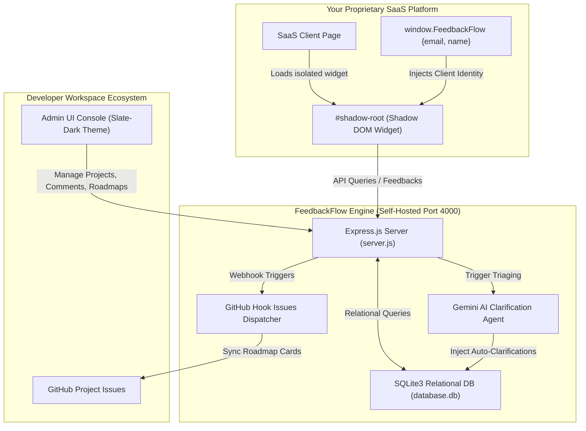

<p align="center">
  
</p>

<h1 align="center">FeedbackFlow</h1>

<p align="center">
  <strong>The Zero-Bloat, Self-Hostable, and Enterprise-Ready Customer Feedback & Roadmap Platform.</strong>
</p>

<p align="center">
  <a href="https://github.com/organization/feedbackflow/blob/main/LICENSE"></a>
  <a href="https://github.com/organization/feedbackflow/blob/main/packages/widget/LICENSE"></a>
  <a href="https://hub.docker.com/r/feedbackflow/core"></a>
  <a href="https://discord.gg/feedbackflow"></a>
</p>

<p align="center">
  A high-performance, open-source alternative to <strong>Canny</strong>, <strong>Productboard</strong>, and <strong>FeatureUpvote</strong>. Inject a stunning, Shadow-DOM isolated feedback board and release roadmap into your SaaS product in under 60 seconds.
</p>

---

## ⚡ The Zero-Bloat, Zero-Friction Story

Most modern open-source SaaS platforms are plagued by dependency bloat, requiring complex Monorepo workspaces, TypeScript pre-compilers, Lerna configurations, and hundreds of megabytes of `node_modules` just to render a simple card board.

**FeedbackFlow is different.** It was built from the ground up on three core principles:
1. **Zero-Dependency Core**: Only 4 lightweight production dependencies (Express, CORS, JWT, SQLite3).
2. **Single-Service Simplicity**: No complex build pipelines. Just one Express file (`server.js`), one SQLite database file (`database.js`), and a pre-packaged public asset directory (`public/`).
3. **Shadow-DOM Styling Isolation**: The client widget is fully isolated using standard browser Shadow-DOM, ensuring absolute protection against style-bleeds—neither your CSS nor our CSS will ever clash.

---

## 🆚 Comparison: FeedbackFlow vs. Alternatives

| Feature | **FeedbackFlow** 🌟 | **Canny.io** | **Productboard** |
| :--- | :--- | :--- | :--- |
| **Pricing** | **100% Free & Open Source** | $400+/month starter | $25/user/month (Very limited) |
| **Hosting** | Self-hosted (1-Click Docker) | Cloud-only | Cloud-only |
| **Privacy & GDPR** | Complete ownership (Your DB) | Third-party server cookies | Third-party server tracking |
| **Widget Isolation** | **Shadow-DOM Isolated** | Standard iframe / Script bleed | Heavy external redirects |
| **AI Triaging** | Built-in Gemini Triaging Agents | Expensive AI add-on | Team-triage only |
| **Database** | Lightweight SQLite (Zero Setup) | Locked proprietary DB | Locked proprietary DB |
| **Extensibility** | Full REST APIs & Webhooks | Proprietary integrations | Enterprise plan API locks |

---

## 🏗️ System Architecture Flow

The flowchart below visualizes the isolated frontend widget communication with the central feedback engine, database, and background AI triaging systems:



---

## 🌟 Elite Core Features

*   **⚡ Zero-Bleed Customer Widget**: Embed a multi-view feedback widget (Board, Request Submission, Release Roadmap) that works perfectly on React, Next.js, Vue, Svelte, or plain HTML.
*   **🤖 Integrated Gemini AI Agents**: When a user submits a feature request, our AI agent scans the text. If it is too short or vague, it automatically replies in a threaded comment as an AI Assistant, asking clarifying questions. It also triages the submission into categories (**Bug**, **Feature**, **Improvement**).
*   **🔐 User Identification API**: Prefill and hide contact forms automatically if the customer is already signed into your SaaS by configuring simple global window states.
*   **🎨 Dynamic Customizer**: Visual color picker, title updater, and layout position editor with real-time mockup compiling and script distribution.
*   **📈 High-Density Analytics**: Native interactive SVG dashboards tracking roadmap transitions, voting velocity, and monthly feedback distributions.
*   **💬 Threaded Discussions**: Connect with clients directly. Write official team replies in card drawers with custom role tags.
*   **🔄 GitHub Issue Sync Webhook**: Automatically creates and syncs GitHub issues when feedback status changes to "Planned" or "In Progress", closing the developer loop.

---

## ⚡ Quick Start: 5-Second Docker Deploy

The fastest way to deploy FeedbackFlow to your VPS (DigitalOcean, AWS, Linode) or local server is using Docker Compose.

### 1. Define `docker-compose.yml`
Save the following configuration inside your workspace directory:

```yaml
version: '3.8'

services:
  feedbackflow:
    container_name: feedbackflow
    image: node:18-alpine
    working_dir: /usr/src/app
    volumes:
      - .:/usr/src/app
    ports:
      - "4000:4000"
    environment:
      - PORT=4000
      - NODE_ENV=production
      - JWT_SECRET=change-this-to-a-secure-uuid-string-in-production
      - GEMINI_API_KEY=YOUR_OPTIONAL_GOOGLE_GEMINI_KEY
    command: sh -c "npm install && npm start"
    restart: unless-stopped
```

### 2. Deploy
Run the following terminal command in your workspace directory:
```bash
docker compose up -d
```
That's it! 
*   **Admin Console**: Visit [http://localhost:4000](http://localhost:4000)
*   **Default Admin**: Username `admin` / Password `password123` *(Create a new admin in Settings immediately!)*
*   **Developer Portal**: Visit [http://localhost:4000/developer-portal.html](http://localhost:4000/developer-portal.html)
*   **Mock SaaS Playground**: Visit [http://localhost:4000/test-site.html](http://localhost:4000/test-site.html)

---

## 🔧 Environment Configurations

Customize FeedbackFlow by editing your environment variables:

| Variable | Scope | Description | Default |
| :--- | :--- | :--- | :--- |
| `PORT` | System | Network port the Express server binds to | `4000` |
| `NODE_ENV` | Mode | Development or Production context | `production` |
| `JWT_SECRET` | Security | Encryption signature key for session JWTs | `super-secret-...` |
| `GEMINI_API_KEY` | [Optional] | Google API Key to enable AI Auto-Triaging | *(Disabled)* |

---

## 📖 REST API Cheat Sheet

FeedbackFlow exposes high-performance JSON REST endpoints:

### Public/Widget Endpoints
*   `GET /api/widget-config?apiKey=YOUR_API_KEY`: Retrieve style and branding tokens.
*   `GET /api/feedback?projectId=ID`: List all feedback for a specific project.
*   `POST /api/feedback`: Submit new feedback. AI Agents process this dynamically.
*   `POST /api/feedback/:id/vote`: Submit an upvote (or remove vote) for a feedback card.
*   `GET /api/feedback/:id/comments`: Fetch discussion comments.
*   `POST /api/feedback/:id/comments`: Add a comment thread post.

### Protected Admin Endpoints (Requires `Authorization: Bearer <JWT_TOKEN>`)
*   `GET /api/projects`: List projects.
*   `POST /api/projects`: Create a project.
*   `PUT /api/projects/:id/theme`: Update branding parameters.
*   `PUT /api/feedback/:id/status`: Update roadmap status. Triggers GitHub Webhooks.
*   `GET /api/analytics`: Aggregate relational metrics and monthly counts.

---

## 🤝 Community & Contributions

We are committed to open-core principles:
1. **Core Admin & Server (`server.js`, `database.js`)**: GNU AGPLv3.
2. **Client Widget Bundle (`public/widget.js`, `public/widget.css`)**: MIT License (Highly permissive, copy into closed-source apps!).

We love contributions!
```bash
# Clone the repository
git clone https://github.com/organization/feedbackflow.git

# Install zero-bloat dependencies
npm install

# Run the local server
npm start
```

*Join the COSS feedback movement! Fork, submit a PR, and give us a ⭐ on GitHub!*
